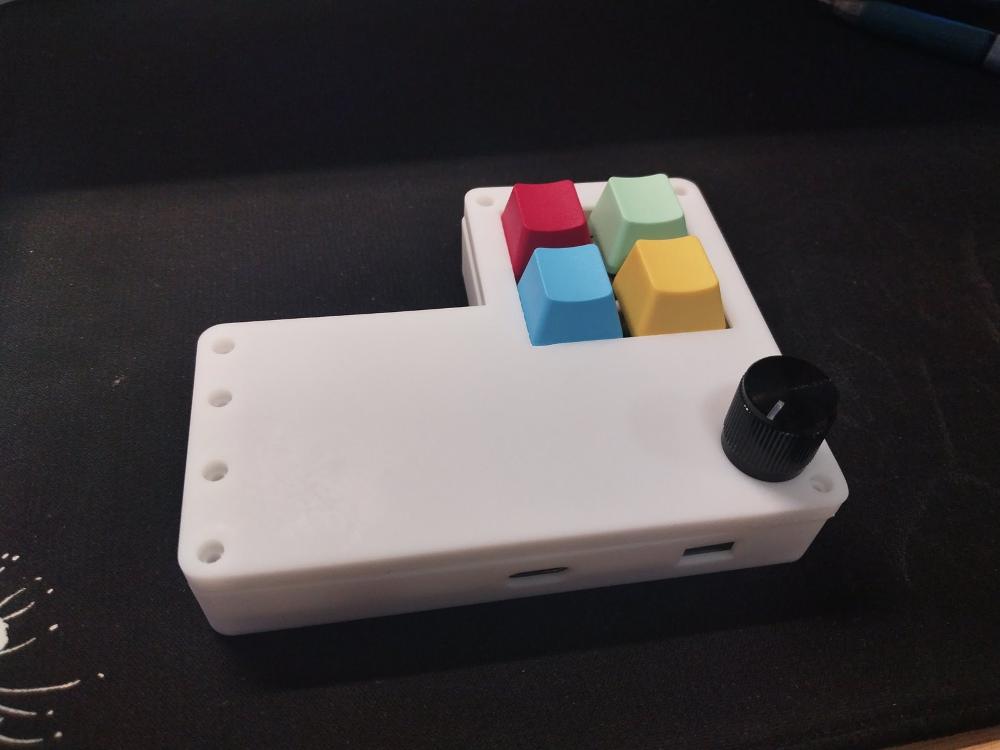
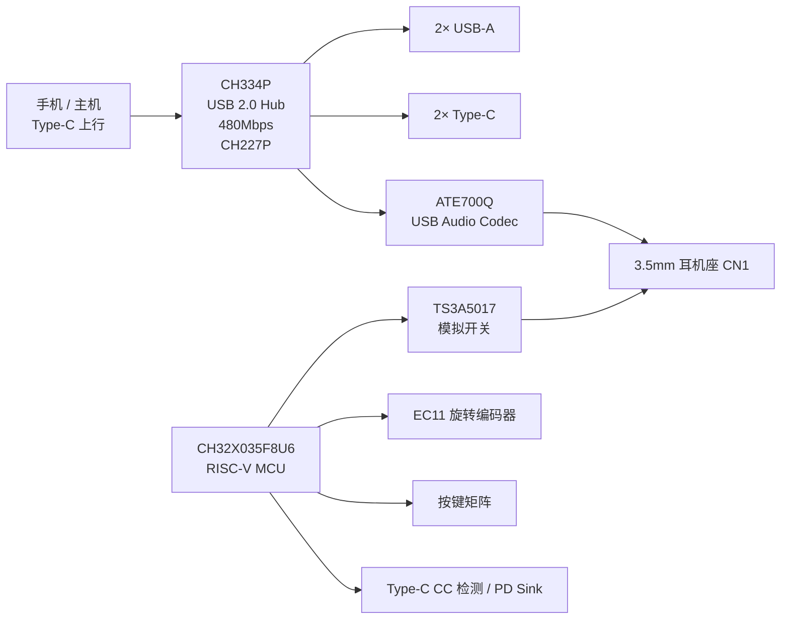
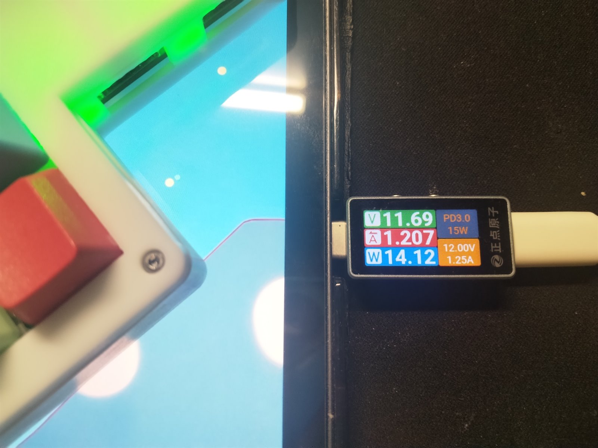
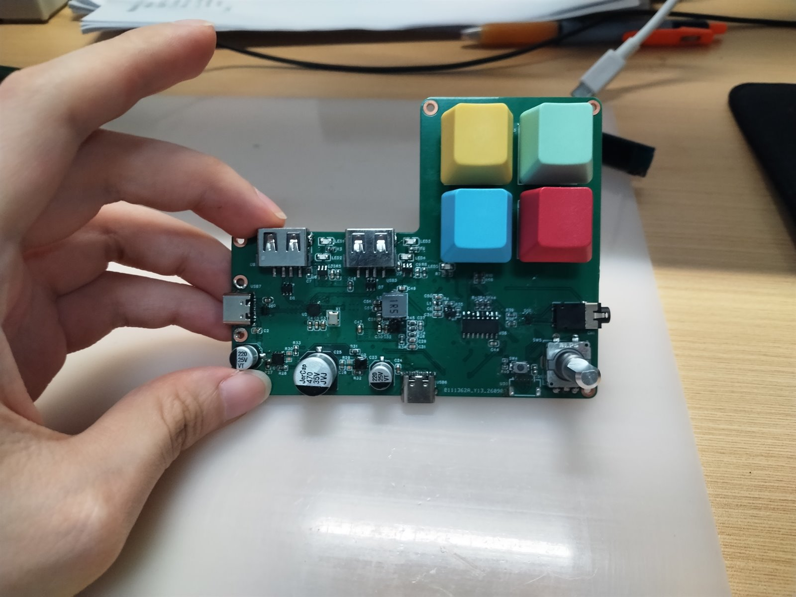
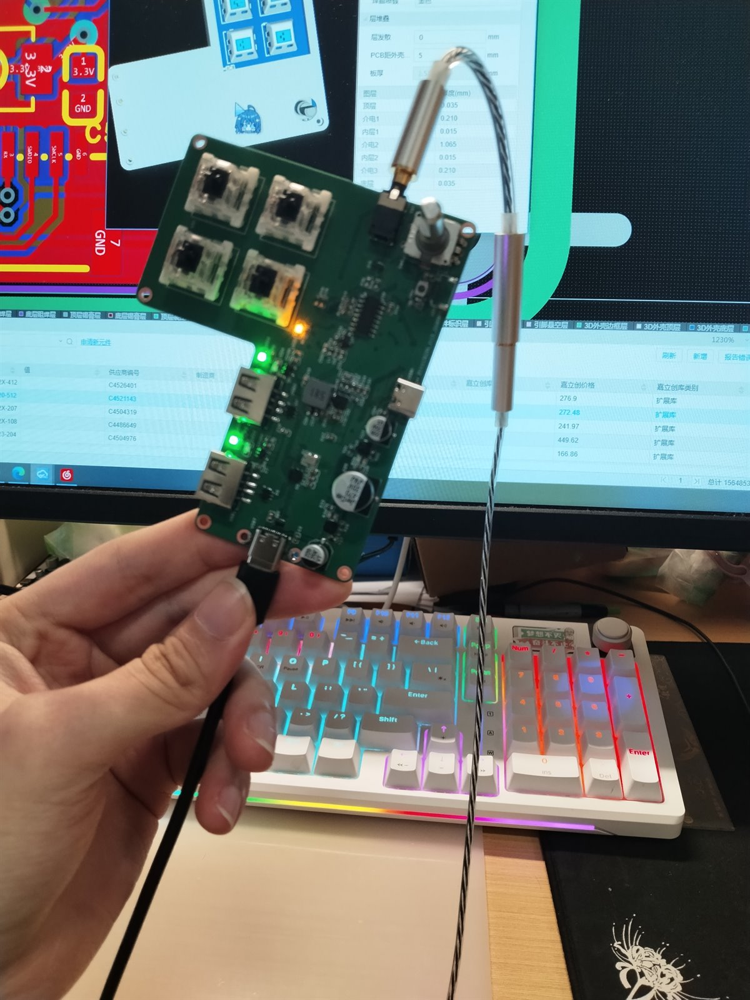
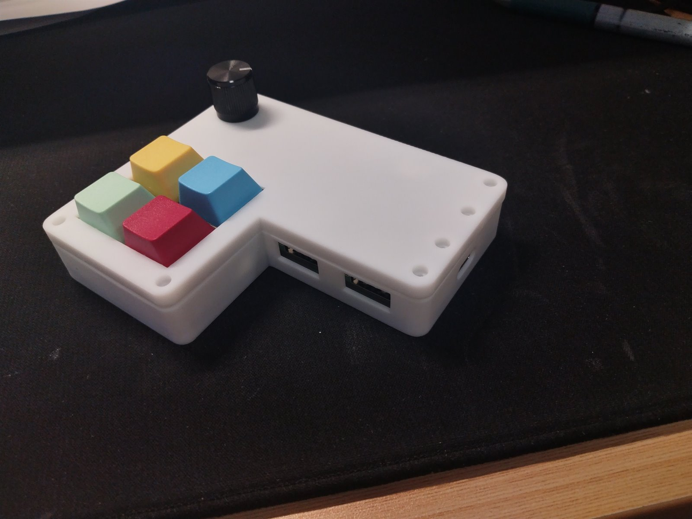
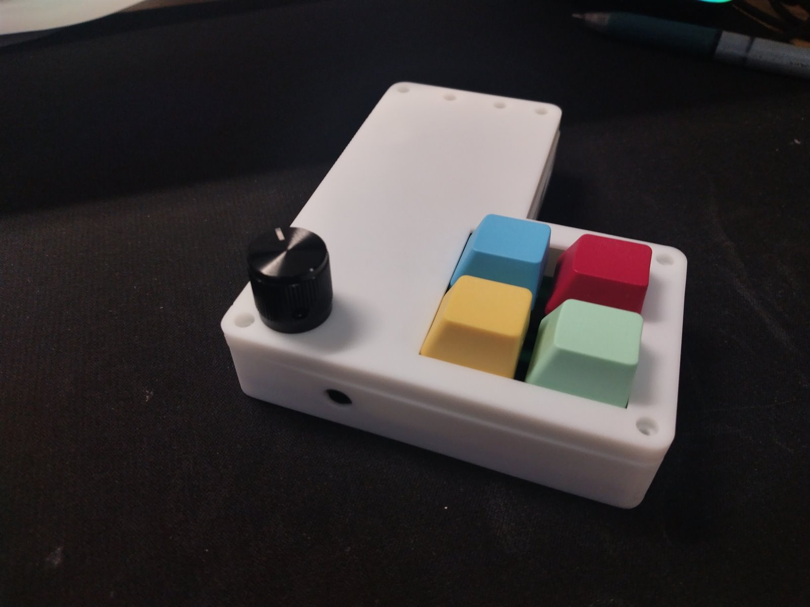

# USB-C Multifunction

一款面向消费电子的 **USB Type-C 多功能扩展设备**：在单根 Type-C 连接下同时实现 USB 扩展、PD 快充透传、USB Audio 与外设线控交互，解决移动设备取消 3.5mm 耳机孔后「边充电边使用有线耳机」的问题。

> *A USB Type-C multifunction dock featuring USB 2.0 hub expansion, PD pass-through charging, a built-in USB audio codec, and MCU-based headset remote emulation.*

本项目为个人独立完成的完整硬件项目，涵盖系统方案设计与器件选型、4 层 PCB 设计、外壳结构设计与裸机固件开发。

设计初衷很直接：让那些喜欢同时插着一堆外设的人，可以边充电边用。



*成品外观：4 个可编程按键 + EC11 旋钮，外壳为自建 3D 模型打印件。*

---

## 目录

- [功能特性](#功能特性)
- [系统架构](#系统架构)
- [实测指标](#实测指标)
- [硬件设计](#硬件设计)
- [结构设计](#结构设计)
- [设计演进与实物](#设计演进与实物)
- [固件](#固件)
- [仓库结构](#仓库结构)
- [待办与已知问题](#待办与已知问题)
- [致谢与许可](#致谢与许可)

---

## 功能特性

| 功能 | 说明 |
| --- | --- |
| **USB 扩展** | 基于 CH334P 四口 USB 2.0 Hub，下行提供 2× USB-A 与 2× Type-C 接口，支持 480Mbps 高速模式 |
| **PD 快充透传** | 由 MCU 完成 Type-C CC 检测与 PD Sink 逻辑，扣除板载约 5W 供电后，最大可透传 95W 快充 |
| **USB Audio** | 板载 ATE700Q 音频编解码芯片，支持 44.1kHz / 96kHz 采样，可直接驱动 16–32Ω 耳机 |
| **线控交互** | 通过模拟开关与 MCU 时序控制模拟 CTIA 标准线控协议，以阻抗脉冲方式注入按键事件，扩展声卡线控功能 |
| **正反插识别** | Type-C CC 检测实现设备端正反插识别，并动态切换外围信号通道 |
| **可编程控制** | 4 个可编程按键与 EC11 旋转编码器，由 CH32X035F8U6 裸机固件驱动，实现 USB HID 复合设备与事件管理 |

## 系统架构



> 上图为简化示意，完整连接关系以 [`hardware/schematic`](hardware/schematic) 中的原理图为准。

## 实测指标

| 项目 | 结果 |
| --- | --- |
| USB 集线器速率 | 480Mbps 高速模式 |
| 快充功率 | 扣除板载约 5W 供电后，设计最大透传 95W |
| PD 实测 | 用 20W 充电器验证 PD 透传通路：协议 PD3.0 握手成功，协商到 15W 档位（12V / 1.25A），实测 14.12W |
| 音频采样率 | 44.1kHz / 96kHz |
| 耳机驱动能力 | 16–32Ω |



*以平板为受电端的 PD 实测：协议 PD3.0，电压 11.69V、电流 1.207A，功率 14.12W。这里之所以只看到 15W 档，是因为手上的充电器最大输出只有 20W——该测试的目的不是验证功率上限，而是确认板上约 5W 的自耗确实是从透传功率里扣除的。*

## 硬件设计

4 层板设计，重点处理 USB 2.0 差分信号阻抗与等长、电源平面规划以及高速信号回流路径；针对 USB、电源与模拟音频接口分别设计 ESD 防护与可靠性措施。

### 核心器件

| 位号 | 型号 | 厂商 | 作用 |
| --- | --- | --- | --- |
| U1 | CH32X035F8U6 | 南京沁恒 (WCH) | 主控 MCU，RISC-V 内核，负责 CC 检测、线控时序与 HID 通信 |
| U2 | CH334P | 南京沁恒 (WCH) | USB 2.0 四口 Hub 控制器 |
| U10 | CH227P | 南京沁恒 (WCH) | PD 快充协议芯片，与 CH334P 共同构成 HUB + PD 方案 |
| U29 | ATE700Q | — | USB 音频编解码（板载声卡） |
| U36 | TS3A5017DR | TI | 4:1 模拟开关，用于线控阻抗脉冲注入 |
| U11 / U35 | CH443K | 南京沁恒 (WCH) | 模拟开关，用于外围信号通道切换 |
| SW5 | EC11E15244G1 | ALPSALPINE | 旋转编码器（带按压） |
| CN1 | ST-0337D00-071-1A2H | G-Switch | 3.5mm 音频座 |
| D2/D7/D11/D13 | USBLC6-2SC6 | ST | USB 差分线 ESD 防护 |
| D10/D14/D15/D16 | RClamp0524PATCT | SEMTECH | 高速信号 ESD 防护 |

整个方案围绕 CH334P + CH227P 展开，供电通路同时做过流、过压与静电防护。

- **可编辑工程**：立创EDA 专业版（EasyEDA Pro）的原理图与 PCB 工程文件见 [`hardware/eda`](hardware/eda)，导入后可直接修改。
- **物料清单**：见 [`hardware/bom`](hardware/bom)，含原版 xlsx 与文本版 `BOM_*_2026-09-30.tsv`（UTF-8、Tab 分隔——位号列本身含逗号，用 Tab 分隔可以避免转义问题），文本版便于在 GitHub 上直接预览表格以及做版本对比。

### 制板与焊接注意事项

- 线对板针座（卧贴封装）的原始焊盘偏小，手工焊接时容易连锡。打板前建议手动把这两个焊盘向外加大，可明显降低焊接难度。

## 结构设计

`mechanical/` 下为 EasyEDA Pro 导出的外壳 3D 模型（ASCII STL），上下盖按装配位置导出：

| 文件 | 部件 | Z 范围 |
| --- | --- | --- |
| `enclosure-bottom.stl` | 下盖 | 0 – 15mm |
| `enclosure-top.stl` | 上盖 | 15 – 20mm |

整体外形尺寸约 **103.8 × 84.7 × 20mm**。

## 设计演进与实物

最终方案不是一次成型的。从选型验证到集成，前后经历了几个阶段，各阶段的原理图与制板文件都保留在 [`hardware/legacy`](hardware/legacy) 下，实物照片放在 [`docs/images`](docs/images)。

| 阶段 | 内容 | 记录位置 |
| --- | --- | --- |
| ① 声卡方案验证 | 基于 HS-100B 的 USB 声卡，含外壳 | `hardware/legacy/usb-soundcard-hs100b/` |
| ② 声卡方案更换 | 改用 ATE700Q，体积大幅缩小 | `hardware/legacy/usb-soundcard-ate700q/` |
| ③ 主体功能验证 | 4 口 HUB + PD 快充主板（原理图 v1） | `hardware/legacy/hub-v1/` |
| ④ 系统集成 | HUB + PD + 声卡 + MCU 线控合成单板 | 本仓库 `hardware/` `mechanical/` `firmware/` |

### 实物照片

最终版（阶段 ④）：

| 照片 | 说明 |
| --- | --- |
|  | 焊接完成的主板：4 个可编程按键、EC11 旋钮、USB-A、Type-C 与 3.5mm 耳机座 |
|  | 上电调试：板载指示灯状态与逻辑分析仪抓取 |
|  | 装壳后侧面的 USB 扩展口 |
|  | 装壳后侧面的 3.5mm 音频座开孔 |

早期版本（阶段 ①②③）的照片见 [`docs/images`](docs/images)：[4 口 HUB + PD 主板 v1](docs/images/hub-pd-mainboard-v1.jpg)、[HS-100B 声卡装壳成品](docs/images/hs100b-usb-soundcard-enclosed.jpg)、[两块声卡对照](docs/images/hs100b-and-ate700q-boards.jpg)、[ATE700Q 声卡小板](docs/images/ate700q-usb-soundcard-board.jpg)、[系统联调](docs/images/system-integration-test.jpg)、[X033-NanoPlus 键盘外设](docs/images/x033-nanoplus-keyboard.jpg)。

## 固件

### 开发环境

| 项目 | 说明 |
| --- | --- |
| MCU | CH32X035F8U6（RISC-V，62KB Flash / 20KB SRAM） |
| IDE | MounRiver Studio（内置 RISC-V GCC 工具链，工程基于 Eclipse CDT） |
| 调试器 | WCH-Link |
| 系统时钟 | 48MHz（HSI） |

### 编译与烧录

1. 使用 MounRiver Studio 打开 `firmware/CH32X035F8U6` 目录（含 `.project` / `.cproject`，可直接导入）。
2. 编译后固件输出为 `obj/CH32X035F8U6.hex`。
3. 连接 WCH-Link，烧录配置已保存在 `.template` 中：起始地址 `0x08000000`，擦除 → 编程 → 校验 → 复位。

> `obj/` 为编译产物，已通过 `.gitignore` 排除，首次编译时由 IDE 自动生成。
> 所有源码文件使用 **UTF-8** 编码，若中文注释显示异常请在 IDE 中将工程编码设置为 UTF-8。

### 主要模块

| 文件 | 功能 |
| --- | --- |
| `User/main.c` | 主循环、TIM1 1ms 系统节拍、EC11 处理、模拟开关通道控制 |
| `User/PD_Process.c` | Type-C CC 电平检测与 PD Sink 状态机 |
| `User/usbd_compostie_km.c` | USB HID 复合设备按键扫描与数据上报 |
| `User/usb_desc.c` | USB 描述符定义 |
| `User/ch32x035_usbfs_device.c` | USBFS 设备底层驱动 |
| `Core/` `Peripheral/` `Startup/` `Debug/` | 沁恒官方 CH32X035 SDK（外设驱动、内核、启动文件、调试打印） |

### 关键实现

- **非阻塞状态机**：以 1ms 定时器中断为时基，EC11 旋转编码器采用状态机 + 计数消抖，避免在主循环中阻塞等待。
- **线控协议模拟**：按 CTIA 标准，通过 TS3A5017 切换不同阻抗通道（如 240Ω / 470Ω）产生阻抗脉冲，模拟音量键与播放/暂停按键。
- **PD / CC 检测**：CC 电平轮询检测配合 PB12 通道翻转，实现正反插识别与外围信号切换。

## 仓库结构

```
USB-C-Multifunction
├── hardware/                          硬件设计
│   ├── schematic/                     最终版原理图（PDF）
│   ├── eda/                           立创EDA 专业版工程（可编辑源文件）
│   ├── pcb/                           最终版 Gerber 制板文件
│   ├── bom/                           物料清单（xlsx + tsv）
│   └── legacy/                        历史版本，保留原始记录
│       ├── hub-v1/                    4 口 HUB + PD 主板 v1
│       ├── usb-soundcard-ate700q/     ATE700Q 声卡方案
│       └── usb-soundcard-hs100b/      HS-100B 声卡方案
├── mechanical/                        外壳 3D 模型（STL）
├── firmware/                          嵌入式固件
│   └── CH32X035F8U6/                  MounRiver Studio 工程
├── X033-NanoPlus/                     子项目：CH32X033F8P6 键盘 HID 外设
└── docs/                              说明文档与实物照片
    ├── project-description.txt
    ├── notes-2026-09.txt
    └── images/
```

> `hardware/legacy/` 与 `X033-NanoPlus/` 是开发过程中留下的早期设计与衍生子项目，原样保留以便追溯，代码与图纸未做清理。对外代表本项目的最终成果以 `hardware/` `mechanical/` `firmware/` 三个目录为准。

## 待办与已知问题

### 已知问题：上行口正反插识别不稳定

上行 Type-C 的正反插识别尚未完全稳定——两种插入方向中总有一个方向异常，另一个方向功能正常：

- **接入手机 / 平板等移动设备时**：某一个固定方向无法识别到 PD 快充，其余功能（USB 扩展、音频）均正常。
- **接入电脑时**：某一个固定方向无法识别到板载键盘。但用 USB 设备树查看器可以确认电脑已正确识别到该 HID 设备，只是 Wireshark 抓不到按键按下时上报的数据。

可能的成因有两个方向，都还没有深入验证：

- **CC 检测与通道切换的时序**：当前固件通过 PB12 在两个 CC 通道间翻转，切换窗口与对端设备的 CC 采样时刻可能对不齐。
- **MCU 未外接晶振**：主控只用了内部 RC 振荡器（HSI 48MHz），时钟精度不如外部晶振，可能压缩了 USB 通信与 CC 检测的时序余量。HUB 芯片 CH334P 的外部晶振是齐全的，因此 USB 扩展功能不受影响，异常只出现在上行口相关的部分。

### 待办

- [ ] `hardware/legacy/` 下各历史版本仍然只有 Gerber，没有对应的可编辑工程
- [ ] 补充外壳 STEP 或原始建模文件
- [ ] 定位并修复上行口正反插识别问题
- [ ] 补充音频采样率等其余测试项的截图
- [ ] 补充装配说明与接线示意

## 致谢与许可

- MCU 外设驱动、内核与启动文件基于南京沁恒（WCH）官方 CH32X035 SDK（PeripheralVersion 1.9），相关文件保留原始版权声明。
- 其余部分由本人独立完成，采用 [MIT License](LICENSE) 开源。
